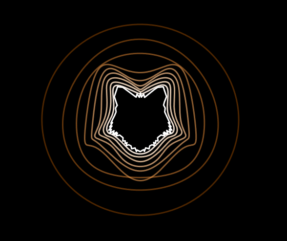

# Sofourier

Here it is! The Fouriertizor! 
The only one Python script based on the beloved Matplotlib, Pandas (ok... just to read `csv`) stack to make art with science!
Fourier Serie Decomposition to the rescue of course... it's *Sofourier*!

See the main part of the script for examples, have a look to `out` dir (or below) for a feeling about this "art".

```python
    data_in = 'input_fig/'
    dir_out = 'out/'

    # black background and one hue
    # assuming path closed, or at least closable
    fn = 'renard.csv' 
    my_sofourier = Sofourier(data_in + fn, delimiter=';', decimal=',')
    my_sofourier.set_color(main_color_hue=0.08)
    my_sofourier.set_maxrank(10)
    my_sofourier.set_sat(0, 1)
    my_sofourier.set_alpha(0.3, 1)
    myfig = my_sofourier.plot()
    myfig.savefig(dir_out + 'sofourier_renard.pdf')
```



## License
This software in under GPLv3, see LICENSE.txt and GPLv3.txt for more information.